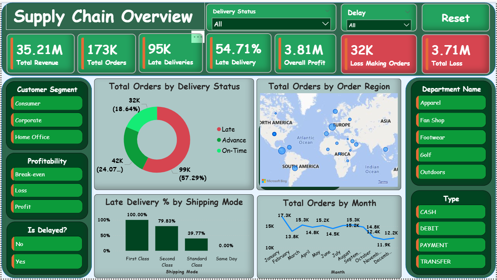

# 🚚 Supply Chain Performance Analysis & Late Delivery Prediction System

An end-to-end Supply Chain Analytics project built using **Python, SQL, Power BI, DAX, and Machine Learning** to analyze 172K+ orders, identify operational bottlenecks, uncover revenue risks, and predict late deliveries before shipment.

---

# 📌 Project Overview

This project focuses on analyzing supply chain operations to identify:

* Delivery inefficiencies
* Revenue exposure from delayed shipments
* Shipping mode failures
* Regional bottlenecks
* Department-level operational issues
* High-risk orders using predictive machine learning

The project combines:

* Data Cleaning & Analysis
* KPI Monitoring
* Interactive Dashboarding
* Business Reporting
* Predictive Machine Learning

---

# 🎯 Business Problem

The organization was facing:

* High late delivery rates
* Revenue loss risks
* Poor logistics performance
* Operational inefficiencies
* Lack of predictive monitoring systems

The goal was to develop a data-driven solution capable of:

✅ Monitoring supply chain KPIs
✅ Detecting operational bottlenecks
✅ Identifying high-risk shipments
✅ Predicting late deliveries before occurrence
✅ Supporting strategic business decisions

---

# 📊 Key Insights

## ⚠️ 54.71% Late Delivery Rate

More than half of all orders were delivered late, indicating severe systemic logistics inefficiencies.

---

## 💰 $19.25M Revenue at Risk

Delayed shipments contributed to:

* 54.7% of total revenue
* High customer attrition risk
* Refund & cancellation exposure

---

## 🚨 First Class Shipping Failure

| Metric             | Value  |
| ------------------ | ------ |
| First Class Orders | 26,513 |
| Delay Rate         | 100%   |
| Revenue at Risk    | $5.41M |

Every premium First Class shipment experienced delays.

---

## 🌍 Regional Bottlenecks Identified

Regions with highest delays:

* Central Africa
* Southeast Asia
* Eastern Europe

Primary issue identified:

* Poor last-mile logistics infrastructure

---

## 🤖 Machine Learning Prediction System

A Tuned Random Forest Classifier achieved:

| Metric   | Score |
| -------- | ----- |
| Accuracy | 74%   |
| F1 Score | 77%   |
| Precision | 79%   |

The model predicts high-risk deliveries before shipment occurs.

---

# 🛠️ Tech Stack

## Programming & Analysis

* Python
* SQL
* MySQL
* Pandas
* NumPy

## Visualization & BI

* Power BI
* DAX
* Matplotlib
* Seaborn

## Machine Learning

* Scikit-learn
* Random Forest
* Logistic Regression
* Decision Tree
* AdaBoost
* Gradient Boosting

---

# 📈 Skills Demonstrated

## 📊 Power BI & DAX

* KPI Dashboard Development
* Data Modeling
* Star Schema Design
* Interactive Visualizations
* Drill-through Analysis
* Dynamic KPI Cards
* Revenue Risk Analysis
* Time Intelligence Calculations
* Conditional Formatting
* Trend Analysis

### DAX Measures Used

* Total Revenue
* Revenue at Risk
* Late Delivery Percentage
* On-Time Delivery Rate
* Profitability Metrics
* Delay Percentage by Region
* Delay Percentage by Shipping Mode
* Ranking Measures
* Custom Aggregations

---

## 🐍 Python

* Data Cleaning
* Feature Engineering
* Exploratory Data Analysis
* Data Visualization
* Correlation Analysis
* Predictive Modeling
* Model Evaluation
* Hyperparameter Tuning

---

## 🗄️ SQL

* Data Extraction
* Aggregations
* Group By Analysis
* KPI Calculations
* Revenue Analysis
* Operational Metrics Queries

---

# 🤖 Machine Learning Workflow

## Models Trained

* Logistic Regression
* Decision Tree
* AdaBoost
* Gradient Boosting
* Random Forest
* Tuned Random Forest

---

## Best Model Performance

| Model               | Accuracy | F1 Score |
| ------------------- | -------- | -------- |
| Tuned Random Forest | 74%      | 77%      |

---

## Features Used

* Shipping Mode
* Shipment Days
* Department Name
* Customer Segment
* Region
* Category
* Order Month
* Order Hour

---

# 📈 Business Impact

This project demonstrates how analytics and machine learning can support strategic supply chain optimization.

## Potential Business Impact

✅ Reduce delivery delays
✅ Protect high-risk revenue streams
✅ Improve customer satisfaction
✅ Enable proactive logistics management
✅ Improve operational visibility
✅ Support executive decision-making

---

## 💰 Estimated Revenue Protection

Preventing just **10% of delayed orders** could potentially secure:

# 🚀 ~$1.93M Revenue

---

# 📂 Project Assets

* Power BI Dashboard
* Jupyter Notebook
* Stakeholder Reports
* Dashboard Walkthrough Video
* Machine Learning Analysis

---

# 📷 Dashboard Preview

```markdown id="t8v1ya"

```

---

# 🔗 Connect With Me

## LinkedIn

https://www.linkedin.com/in/kuldeep-jha-b3517b316

## GitHub

https://github.com/jha-kuldeep

---

# 📬 Feedback

Feedback, suggestions, and collaboration opportunities are always welcome.

If you found this project valuable:

* Star ⭐ the repository
* Share your feedback
* Connect on LinkedIn : www.linkedin.com/in/kuldeep-jha-b3517b316

---
